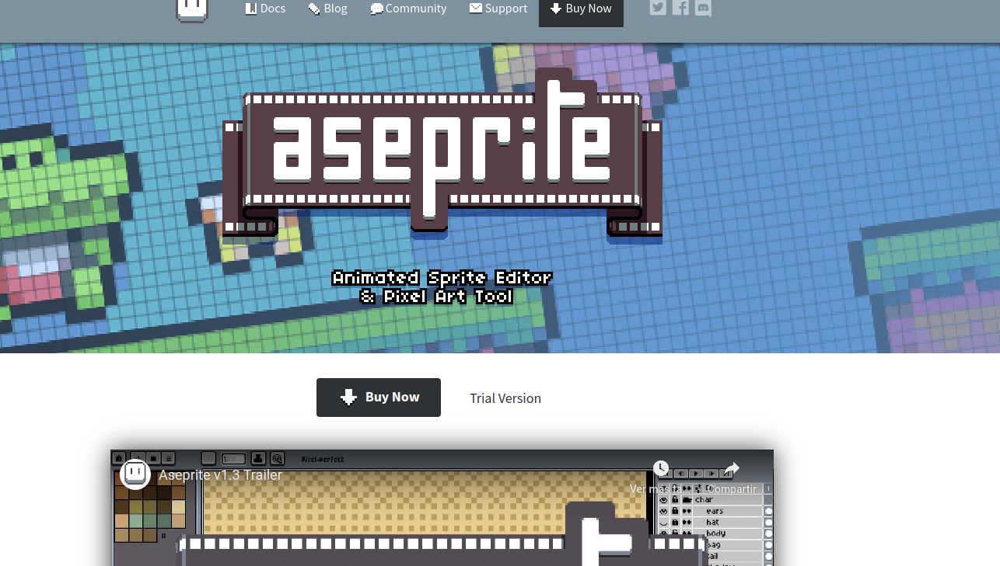

# gguia de instalacion de obs studio

decripcion



## actualizamos la lista de repositorios

```bash
 guillenec@guillenec-net  ~  sudo apt update

[sudo] contraseña para guillenec: 
Des:1 https://dl.google.com/linux/chrome/deb stable InRelease [1.825 B]
Des:2 https://dl.google.com/linux/chrome/deb stable/main amd64 Packages [1.229 B]

```

## instalar las deṕendecias necesarias para usar el programa

```bash
 guillenec@guillenec-net  ~  sudo apt install -y cmake g++ git libx11-dev libxcursor-dev libxi-dev libgl1-mesa-dev libfontconfig1-dev libfreetype6-dev libcurl4-openssl-dev libharfbuzz-dev libwebp-dev libjpeg-dev libpng-dev

```

## intalacion de aseprite
