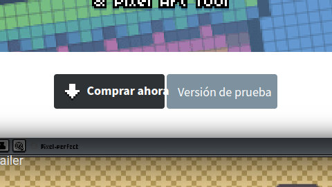
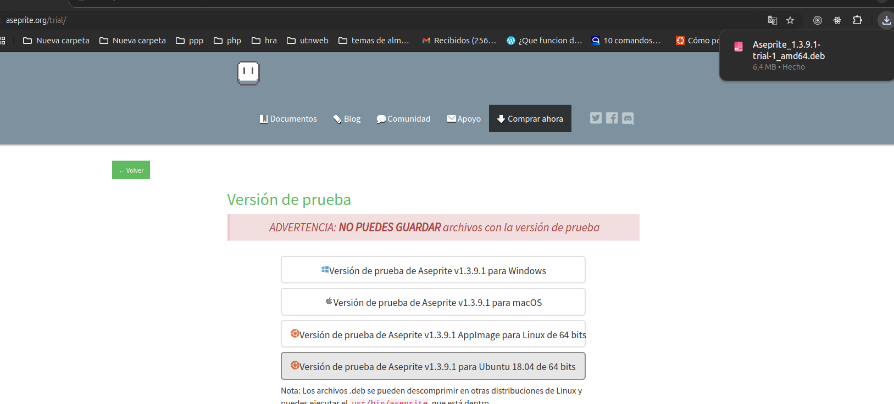
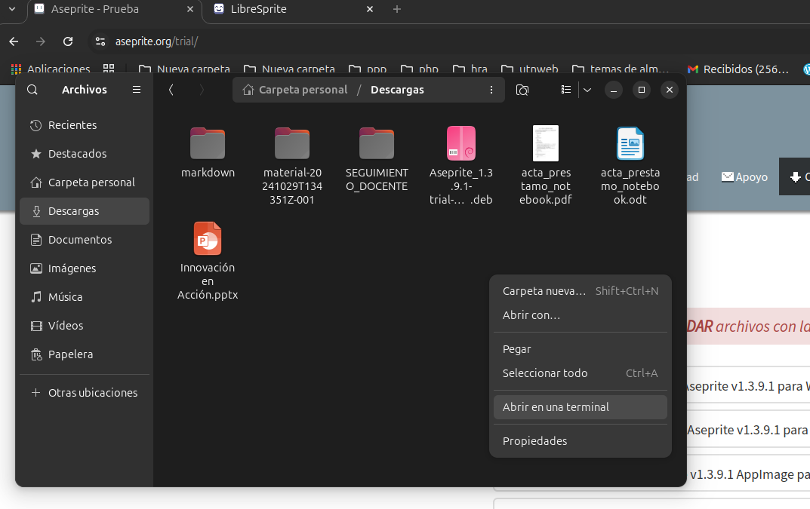
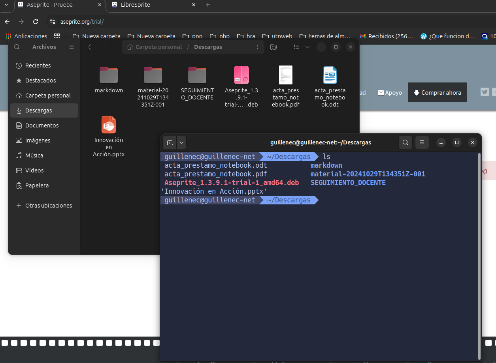
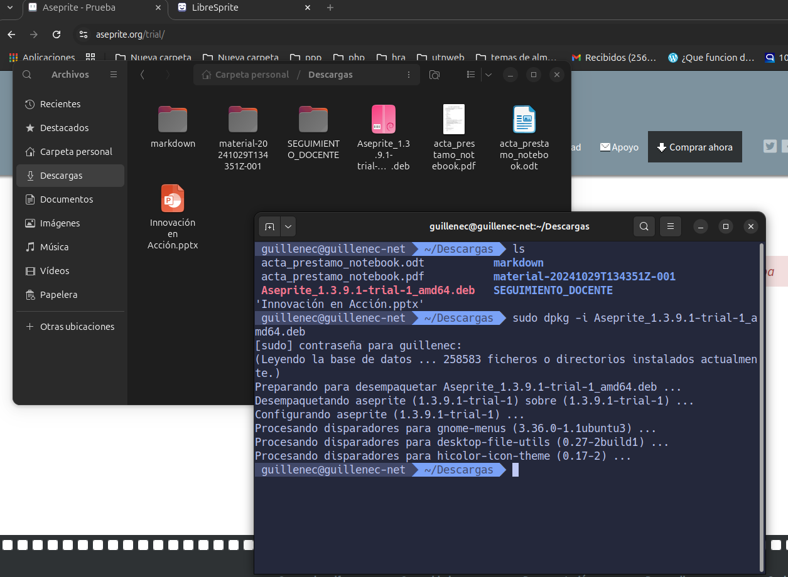
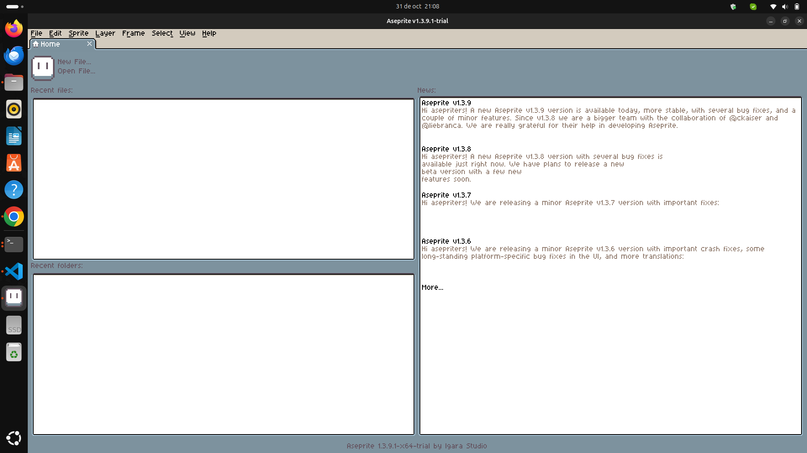
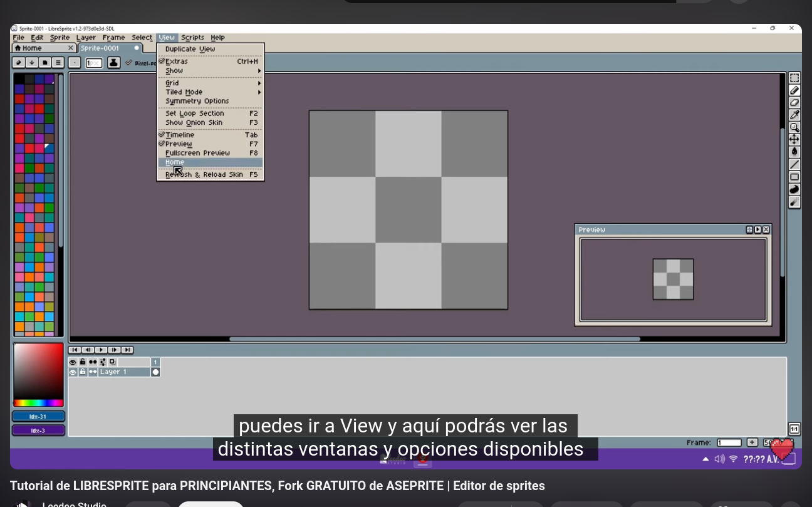

# Guia de instalacion de aseprite

## Descripcion

Es un programa para crear sprites animados.

## Funcionalidades

- Los sprites se componen de capas y cuadros como conceptos separados.
- Soporte para perfiles de color y diferentes modos de color : RGBA, indexado (paletas de hasta 256 colores), escala de grises.
- Funciones de animación , con vista previa en tiempo real y efecto cebolla .
- Exportar/importar animaciones a/desde hojas de sprites , archivos GIF o secuencias de archivos PNG (y FLC, FLI, JPG, BMP, PCX, TGA).
- Admite múltiples editores .
- Grupos de capas para organizar su trabajo y capas de referencia para rotoscopia.
- Herramientas específicas de pixel art como el modo a mano alzada Pixel Perfect , tinta de sombreado , pinceles personalizados , contornos , píxeles anchos , etc.
- Otras herramientas de dibujo especiales como Sensibilidad a la presión , Herramienta de simetría , Selección de trazo y relleno , Degradados .
- Modo mosaico útil para dibujar patrones y texturas.
- Transformar múltiples fotogramas/capas al mismo tiempo.
- Capacidades de scripting de Lua .
- CLI - Interfaz de línea de comandos para automatizar tareas.
- Referencia rápida / Hoja de trucos de atajos de teclado ( teclas personalizables y rueda del mouse ).
- Vuelva a abrir archivos cerrados y recupere datos en caso de falla.
- Deshacer/Rehacer para cada operación y soporte para deshacer no lineal .


## Instalacion de Aseprite GUIa dada por chat gpt

### Actualizamos la lista de repositorios

```bash
 guillenec@guillenec-net  ~  sudo apt update

[sudo] contraseña para guillenec: 
Des:1 https://dl.google.com/linux/chrome/deb stable InRelease [1.825 B]
Des:2 https://dl.google.com/linux/chrome/deb stable/main amd64 Packages [1.229 B]

```

### instalar las deṕendecias necesarias para usar el programa

```bash
 guillenec@guillenec-net  ~  sudo apt install -y cmake g++ git libx11-dev libxcursor-dev libxi-dev libgl1-mesa-dev libfontconfig1-dev libfreetype6-dev libcurl4-openssl-dev libharfbuzz-dev libwebp-dev libjpeg-dev libpng-dev

```

### clonamos el repo

```bash
git clone --recursive <https://github.com/aseprite/aseprite.git>

```

### Descarga y Compila Skia

Aseprite necesita Skia, una biblioteca gráfica que se usa para el renderizado. Dirígete al directorio de Aseprite y sigue estos pasos:

```bash
 guillenec@guillenec-net  ~  ls aseprite 
cmake               CODEOWNERS       docs        laf        tests
CMakeLists.txt      CONTRIBUTING.md  EULA.txt    README.md  third_party
CODE_OF_CONDUCT.md  data             INSTALL.md  src
 guillenec@guillenec-net  ~  cd aseprite 
 guillenec@guillenec-net  ~/aseprite   main  mkdir build

 guillenec@guillenec-net  ~/aseprite   main  cd build 
 guillenec@guillenec-net  ~/aseprite/build   main  cmake -DCMAKE_BUILD_TYPE=RelWithDebInfo -DLAF_BACKEND=skia -DSKIA_DIR=../skia -DSKIA_LIBRARY_DIR=../skia/out/Release-x64 -DSKIA_LIBRARY=skia ../

-- The C compiler identification is GNU 13.2.0
-- The CXX compiler identification is GNU 13.2.0
-- Detecting C compiler ABI info
-- Detecting C compiler ABI info - done
-- Check for working C compiler: /usr/bin/cc - skipped
-- Detecting C compile features
-- Detecting C compile features - done
-- Detecting CXX compiler ABI info
-- Detecting CXX compiler ABI info - done
-- Check for working CXX compiler: /usr/bin/c++ - skipped

...

-- Found X11: /usr/include   
-- Looking for XOpenDisplay in /usr/lib/x86_64-linux-gnu/libX11.so;/usr/lib/x86_64-linux-gnu/libXext.so
-- Looking for XOpenDisplay in /usr/lib/x86_64-linux-gnu/libX11.so;/usr/lib/x86_64-linux-gnu/libXext.so - found
-- Looking for gethostbyname
-- Looking for gethostbyname - found
-- Looking for connect
-- Looking for connect - found
-- Looking for remove
-- Looking for remove - found
-- Looking for shmat
-- Looking for shmat - found
-- Looking for XOpenIM in X11
-- Looking for XOpenIM in X11 - found
-- laf backend: skia
-- laf zlib: zlibstatic
-- laf pixman: pixman
-- laf freetype: FREETYPE_LIBRARY-NOTFOUND
-- laf harfbuzz: HARFBUZZ_LIBRARY-NOTFOUND
-- skia dir: /home/guillenec/aseprite/skia
-- skia library: /home/guillenec/aseprite/build/skia
-- skia library dir: /home/guillenec/aseprite/skia/out/Release-x64
-- aseprite libwebp: WEBP_LIBRARIES-NOTFOUND
-- Configuring done (61.1s)
-- Generating done (0.3s)
-- Build files have been written to: /home/guillenec/aseprite/build
 guillenec@guillenec-net  ~/aseprite/build   main  

```

**Aca nos dio error y posiblemente no ande** Esto por guiarnos 100 % por chat gpt..

## Instalacion con .deb

Un archivo .deb es un paquete de software comprimido que se utiliza para instalar programas en distribuciones de Linux, como Ubuntu, Linux Mint o Kali Linux. Este tipo de archivos contiene todo lo necesario para la instalación, como los archivos del programa, la documentación y los scripts de administración

### descargaremos el .deb de asesprite

- Para ello primero seleccionamos la version de pruebas, ya que la version normal es paga.
    

- Procedemos a descargar el binario .deb
    

- Luego vamos a descargas, donde encontraremos el .deb descargado y abriremos una terminal para poder instaklarlo.
    

- Podemos listar para comprobar que estamos parado en el directorio de Descargas donde se encuentra el aseprite.deb.  
    

- Procedemos a instalarlo con dpkg
    

**Nota 📓 que es dpkg:**
Visión general creada por IA
Más información
…
Dpkg es un programa que se utiliza para gestionar paquetes en Debian GNU/Linux y sistemas basados en Debian, como Ubuntu. Sus funciones son:
-Instalar paquetes
-Quitar paquetes
-Proporcionar información sobre los paquetes
-Compilar paquetes
-Configurar paquetes
-Recuperar información de los paquetes

***

- Listo ya estaria andando el programa:


## Problemas

Aseprite ya no es gratuito al 100%, y no nos permite guardar, por lo que quizas necesitemos buscar una alternativa libre y gratuita, Una alternativa podria ser [LibreSprite](https://libresprite.github.io/#!/downloads) o [pixelOrama](https://orama-interactive.itch.io/pixelorama).

[](https://youtu.be/2j5A35ey3wM)
