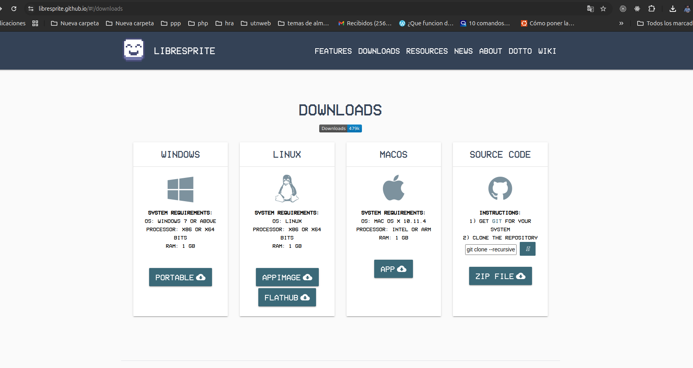
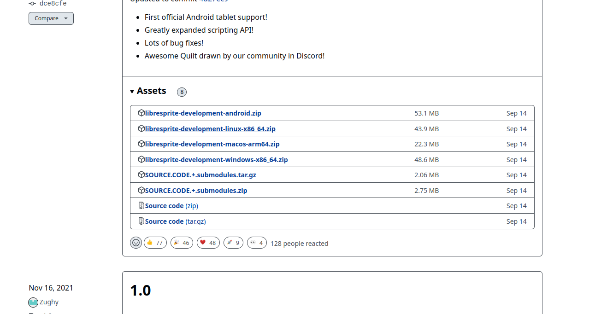
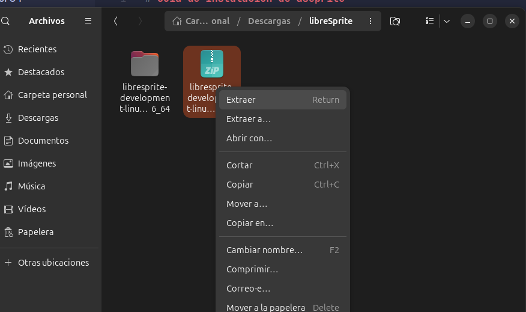
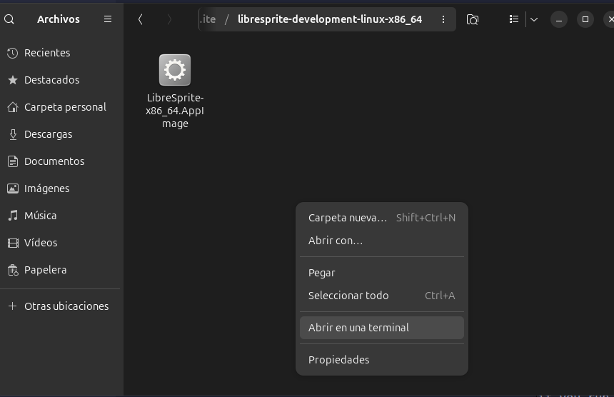
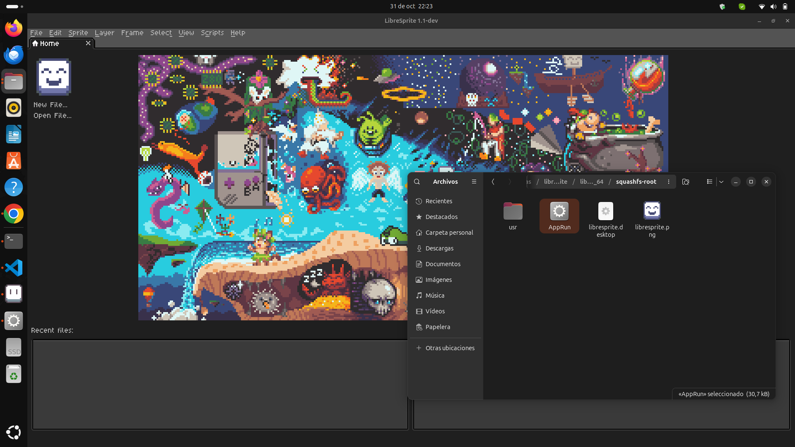

# Guia de instalacion de aseprite

## Descripcion

Es un programa para crear sprites animados.

## Funcionalidades

- Los sprites se componen de capas y cuadros como conceptos separados.
- Soporte para perfiles de color y diferentes modos de color : RGBA, indexado (paletas de hasta 256 colores), escala de grises.
- Funciones de animación , con vista previa en tiempo real y efecto cebolla .
- Exportar/importar animaciones a/desde hojas de sprites , archivos GIF o secuencias de archivos PNG (y FLC, FLI, JPG, BMP, PCX, TGA).
- Admite múltiples editores .
- Grupos de capas para organizar su trabajo y capas de referencia para rotoscopia.
- Herramientas específicas de pixel art como el modo a mano alzada Pixel Perfect , tinta de sombreado , pinceles personalizados , contornos , píxeles anchos , etc.
- Otras herramientas de dibujo especiales como Sensibilidad a la presión , Herramienta de simetría , Selección de trazo y relleno , Degradados .
- Modo mosaico útil para dibujar patrones y texturas.
- Transformar múltiples fotogramas/capas al mismo tiempo.
- Capacidades de scripting de Lua .
- CLI - Interfaz de línea de comandos para automatizar tareas.
- Referencia rápida / Hoja de trucos de atajos de teclado ( teclas personalizables y rueda del mouse ).
- Vuelva a abrir archivos cerrados y recupere datos en caso de falla.
- Deshacer/Rehacer para cada operación y soporte para deshacer no lineal .


## Instalacion de Aseprite GUIa dada por chat gpt

### Actualizamos la lista de repositorios

```bash
 guillenec@guillenec-net  ~  sudo apt update

[sudo] contraseña para guillenec: 
Des:1 https://dl.google.com/linux/chrome/deb stable InRelease [1.825 B]
Des:2 https://dl.google.com/linux/chrome/deb stable/main amd64 Packages [1.229 B]

```

### instalar las deṕendecias necesarias para usar el programa

```bash
 guillenec@guillenec-net  ~  sudo apt install -y cmake g++ git libx11-dev libxcursor-dev libxi-dev libgl1-mesa-dev libfontconfig1-dev libfreetype6-dev libcurl4-openssl-dev libharfbuzz-dev libwebp-dev libjpeg-dev libpng-dev

```

### clonamos el repo

```bash
git clone --recursive <https://github.com/aseprite/aseprite.git>

```

### Descarga y Compila Skia

Aseprite necesita Skia, una biblioteca gráfica que se usa para el renderizado. Dirígete al directorio de Aseprite y sigue estos pasos:

```bash
 guillenec@guillenec-net  ~  ls aseprite 
cmake               CODEOWNERS       docs        laf        tests
CMakeLists.txt      CONTRIBUTING.md  EULA.txt    README.md  third_party
CODE_OF_CONDUCT.md  data             INSTALL.md  src
 guillenec@guillenec-net  ~  cd aseprite 
 guillenec@guillenec-net  ~/aseprite   main  mkdir build

 guillenec@guillenec-net  ~/aseprite   main  cd build 
 guillenec@guillenec-net  ~/aseprite/build   main  cmake -DCMAKE_BUILD_TYPE=RelWithDebInfo -DLAF_BACKEND=skia -DSKIA_DIR=../skia -DSKIA_LIBRARY_DIR=../skia/out/Release-x64 -DSKIA_LIBRARY=skia ../

-- The C compiler identification is GNU 13.2.0
-- The CXX compiler identification is GNU 13.2.0
-- Detecting C compiler ABI info
-- Detecting C compiler ABI info - done
-- Check for working C compiler: /usr/bin/cc - skipped
-- Detecting C compile features
-- Detecting C compile features - done
-- Detecting CXX compiler ABI info
-- Detecting CXX compiler ABI info - done
-- Check for working CXX compiler: /usr/bin/c++ - skipped

...

-- Found X11: /usr/include   
-- Looking for XOpenDisplay in /usr/lib/x86_64-linux-gnu/libX11.so;/usr/lib/x86_64-linux-gnu/libXext.so
-- Looking for XOpenDisplay in /usr/lib/x86_64-linux-gnu/libX11.so;/usr/lib/x86_64-linux-gnu/libXext.so - found
-- Looking for gethostbyname
-- Looking for gethostbyname - found
-- Looking for connect
-- Looking for connect - found
-- Looking for remove
-- Looking for remove - found
-- Looking for shmat
-- Looking for shmat - found
-- Looking for XOpenIM in X11
-- Looking for XOpenIM in X11 - found
-- laf backend: skia
-- laf zlib: zlibstatic
-- laf pixman: pixman
-- laf freetype: FREETYPE_LIBRARY-NOTFOUND
-- laf harfbuzz: HARFBUZZ_LIBRARY-NOTFOUND
-- skia dir: /home/guillenec/aseprite/skia
-- skia library: /home/guillenec/aseprite/build/skia
-- skia library dir: /home/guillenec/aseprite/skia/out/Release-x64
-- aseprite libwebp: WEBP_LIBRARIES-NOTFOUND
-- Configuring done (61.1s)
-- Generating done (0.3s)
-- Build files have been written to: /home/guillenec/aseprite/build
 guillenec@guillenec-net  ~/aseprite/build   main  

```

**Aca nos dio error y posiblemente no ande** Esto por guiarnos 100 % por chat gpt..

## Instalacion con .deb

Un archivo .deb es un paquete de software comprimido que se utiliza para instalar programas en distribuciones de Linux, como Ubuntu, Linux Mint o Kali Linux. Este tipo de archivos contiene todo lo necesario para la instalación, como los archivos del programa, la documentación y los scripts de administración

### descargaremos el .deb de asesprite

- Para ello primero seleccionamos la version de pruebas, ya que la version normal es paga.
    

- Procedemos a descargar el binario .deb
    

- Luego vamos a descargas, donde encontraremos el .deb descargado y abriremos una terminal para poder instaklarlo.
    

- Podemos listar para comprobar que estamos parado en el directorio de Descargas donde se encuentra el aseprite.deb.  
    

- Procedemos a instalarlo con dpkg
    

**Nota 📓 que es dpkg:**
Visión general creada por IA
Más información
…
Dpkg es un programa que se utiliza para gestionar paquetes en Debian GNU/Linux y sistemas basados en Debian, como Ubuntu. Sus funciones son:
-Instalar paquetes
-Quitar paquetes
-Proporcionar información sobre los paquetes
-Compilar paquetes
-Configurar paquetes
-Recuperar información de los paquetes

***

- Listo ya estaria andando el programa:


## Problemas

Aseprite ya no es gratuito al 100%, y no nos permite guardar, por lo que quizas necesitemos buscar una alternativa libre y gratuita, Una alternativa podria ser [LibreSprite](https://libresprite.github.io/#!/downloads) o [pixelOrama](https://orama-interactive.itch.io/pixelorama).

[](https://youtu.be/2j5A35ey3wM)

## Instalamos LibreSprite

accedemos a su pagina y seleccionamos alguna de las opciones disponibles para linux, en mi caso usare la AppImage, peroustedes sio quieren pueden usar flatpack.



### Ahora descargamos alguna de las versiones disponible para linux



### Ejecutamos

- Extraemos el archivo en algun directorio y luego le damos permisos de ejecucion:

- en mi caso lo movi dentro de una carpeta en descargas con el nombre de libreSprite y lo extraje ahí.


- luego abro una terminal dentro de la carpeta extraida


- El error que estás viendo indica que la aplicación necesita libfuse.so.2, una biblioteca esencial para ejecutar archivos AppImage. En sistemas como Huayra Linux, es posible que necesites instalar FUSE o una versión compatible para AppImages. Puedes solucionarlo con los siguientes pasos:

  - Instalar libfuse2: Este paquete contiene libfuse.so.2 y es el más probable para resolver el problema.

  ```bash
  #hacemos un update
  ✘ guillenec@guillenec-net  ~/Descargas/libreSprite/libresprite-development-linux-x86_64  sudo apt update

  [sudo] contraseña para guillenec:
  Obj:1 <https://dl.google.com/linux/chrome/deb> stable InRelease
  Obj:2 <https://packages.microsoft.com/repos/code> stable InRelease
  ....
  multiverse amd64 Components [212 B]
  Descargados 910 kB en 3s (262 kB/s)
  Leyendo lista de paquetes... Hecho
  Creando árbol de dependencias... Hecho
  Leyendo la información de estado... Hecho
  Se pueden actualizar 5 paquetes. Ejecute «apt list --upgradable» para verlos.
  ```

  -

  ```bash
  #instalamos el paquete
  guillenec@guillenec-net  ~/Descargas/libreSprite/libresprite-development-linux-x86_64  sudo apt install libfuse2
  Leyendo lista de paquetes... Hecho
  Creando árbol de dependencias... Hecho
  Leyendo la información de estado... Hecho
  Nota, seleccionando «libfuse2t64» en lugar de «libfuse2»
  Se instalarán los siguientes paquetes NUEVOS:
    libfuse2t64
  0 actualizados, 1 nuevos se instalarán, 0 para eliminar y 5 no actualizados.
  Se necesita descargar 89,9 kB de archivos.
  Se utilizarán 326 kB de espacio de disco adicional después de esta operación.
  Des:1 <http://ar.archive.ubuntu.com/ubuntu> noble/universe amd64 libfuse2t64 amd64 2.9.9-8.1build1 [89,9 kB]
  Descargados 89,9 kB en 1s (62,7 kB/s)  
  Seleccionando el paquete libfuse2t64:amd64 previamente no seleccionado.
  (Leyendo la base de datos ... 258583 ficheros o directorios instalados actualmen
  te.)
  Preparando para desempaquetar .../libfuse2t64_2.9.9-8.1build1_amd64.deb ...
  Desempaquetando libfuse2t64:amd64 (2.9.9-8.1build1) ...
  Configurando libfuse2t64:amd64 (2.9.9-8.1build1) ...
  Procesando disparadores para libc-bin (2.39-0ubuntu8.3) ...
   guillenec@guillenec-net  ~/Descargas/libreSprite/libresprite-development-linux-x86_64  ./LibreSprite-x86_64.AppImage --appimage-extract

  squashfs-root/.DirIcon
  squashfs-root/AppRun
  squashfs-root/libresprite.desktop
  ....
  squashfs-root/usr/lib/libz.so.1
  squashfs-root/usr/lib/libzstd.so.1
  ```

  ```bash
  #listamos
   guillenec@guillenec-net  ~/Descargas/libreSprite/libresprite-development-linux-x86_64  ls
  LibreSprite-x86_64.AppImage  squashfs-root
  ```

### Ejecutamos el programa

- Desde la terminal

  ```bash
  #ejecutamos
   guillenec@guillenec-net  ~/Descargas/libreSprite/libresprite-development-linux-x86_64  cd squashfs-root
   guillenec@guillenec-net  ~/Descargas/libreSprite/libresprite-development-linux-x86_64/squashfs-root  ./AppRun
  ```

- Desde la carpeta con doble clic (es lo mismo)

